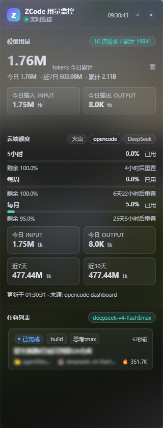

# ZCode 用量监控组件（Electron 版）

基于 Electron 的 ZCode AI 用量监控桌面悬浮组件：无边框置顶悬浮窗，实时展示模型 token 用量、云端套餐额度（火山方舟 / opencode / DeepSeek / 无痕中转）、任务列表与实时活动。真磨砂 Acrylic 玻璃（Win11 原生 Acrylic，Win10 回退 Accent recipe），液态玻璃视觉风格。



## 功能特性

- **模型用量**：今日 / 近 7 日 / 累计 token 统计（本地 `model_usage` 持久表，跨 session 不剪枝），今日输入 / 输出分卡片展示，大数字 SVG 渐变金属质感
- **云端额度**：火山方舟套餐（`GetCodingPlanUsage` / `GetAFPUsage`）、opencode Go 套餐（dashboard 解析）、DeepSeek 官方余额（`/user/balance`）、无痕中转余额+用量（`/v1/usage`），供应商单按钮+下拉面板切换；5 小时 / 每周 / 每月三窗口进度条 + 重置倒计时
- **任务列表**：当前运行任务 + 最近任务（含 token 消耗），点击卡片经 `zcode://open-project` 协议打开对应工作区
- **实时活动**：tail 本地 JSONL 日志，解析工具调用事件流
- **液态玻璃 UI**：深 / 浅双主题令牌，毛玻璃模糊（`blur(32px) saturate(115%)`）+ 天光描边，失焦自动折叠为小图标
- **置顶悬浮**：`alwaysOnTop` 无边框窗口，8 方向自定义 resize，最小 48x48

## 界面说明

窄条竖屏悬浮窗（322x840，默认位于屏幕右缘），自上而下四个区块：

| 区块 | 内容 |
|------|------|
| 顶栏 | Z 渐变 logo、连接状态（绿点"实时连接"）、HH:MM:SS 时钟、设置入口 |
| 模型用量 | 今日累计大数字（如 `1.76M tokens`）、今日 / 近 7 日 / 累计统计行、今日输入 / 输出双子卡、请求次数胶囊 |
| 云端额度 | 火山 / opencode / DeepSeek / 无痕中转 单按钮+下拉面板切换（供应商增多不撑爆标题栏）；火山显示套餐进度条（已用 % + 剩余 % + 重置倒计时），其余显示余额大字 + 2x2 用量网格（今日输入 / 输出、近 7 天 / 近 30 天）；无痕中转另含今日 Tokens / 请求 / 花费（actual_cost）、累计 Tokens 与按模型悬浮明细；底部数据来源与更新时间标注 |
| 任务列表 | 运行中任务置顶，含状态标签（已完成 / 运行中）、模型标签（如 `deepseek-v4-flash$max`）、相对时间、token 消耗 |

## 技术栈

- **框架**：Electron 35（主进程 + preload + contextBridge，`contextIsolation: true`，零 nodeIntegration）
- **数据层**：Node 原生 `node:sqlite`（`DatabaseSync` 只读）+ `https`，火山方舟 SigV4 签名复用 pywebview 版移植逻辑
- **原生能力**：`koffi` 调 `dwmapi.dll`（DWM 属性探针 / Accent 模糊），Win11 `setBackgroundMaterial('acrylic')`，Win10 走 `windowsBackdrop.js` Accent recipe
- **窗口**：frameless + alwaysOnTop + 失焦折叠，前端自实现拖拽与 8 方向 resize（`resizable:false` 窗口 resize 时临时切回）
- **打包**：electron-builder portable 单文件 exe（约 79MB）

## 快速开始

```bash
# 开发运行（需 Node 22.5+，node:sqlite 要求）
npm install
npm start          # 或双击 启动组件.bat
```

或直接运行打包产物 `dist/` 下的 `ZCode Usage Widget*.exe`（便携版，解压到任意目录双击即用）。

## 配置（.volc.env）

凭证查找顺序：**exe 同目录（portable 用 `PORTABLE_EXECUTABLE_DIR`）> 家目录 > 系统环境变量**。开发模式读项目根目录 `.volc.env`。参考：

```bash
# 火山方舟（云端额度 tab 必填，缺失时自动隐藏）
VOLC_AK_ID=xxxx
VOLC_AK_SECRET=xxxx
VOLC_PLAN_TYPE=coding        # coding(默认) | agent
VOLC_PLAN_TIER=Pro           # 可选，仅角标展示
VOLC_PLAN_START=2026-07-15T23:19:00   # 可选，套餐开通时间（倒推分模型明细）

# opencode Go 套餐（dashboard 抓取）
OPENCODE_GO_WORKSPACE_ID=xxx
OPENCODE_GO_AUTH_COOKIE=xxx

# DeepSeek / 无痕中转：key 不在此文件，自动读 ~/.zcode/v2/config.json 的
# ZCode 模型配置，按 baseURL 含 api.deepseek.com / api.wuhen-ai.com 匹配取 apiKey
```

> `.volc.env` 已 gitignore，含火山 AK / opencode cookie 等敏感凭证，勿提交。DeepSeek / 无痕中转的 key 在 ZCode 自身配置（`~/.zcode/v2/config.json`），不在本项目管理范围。

## 数据源

| 数据 | 来源 |
|------|------|
| 任务列表 / token 用量 | `~/.zcode/v2/tasks-index.sqlite` + `~/.zcode/cli/db/db.sqlite` 的 `model_usage` 表 |
| 实时活动 | `~/.zcode/cli/log/zcode-<date>.jsonl`（tail 400 行） |
| 火山套餐额度 | `open.volcengineapi.com` Ark OpenAPI（SigV4，15s 后台刷新） |
| opencode 额度 | dashboard 页面解析（SolidJS SSR 水合数据） |
| DeepSeek 余额 | `api.deepseek.com/user/balance` |
| 无痕中转余额+用量 | `api.wuhen-ai.com/v1/usage`（余额 / 今日累计 / 按模型，15s 后台刷新） |

网络调用全在后台 scheduler（15s 周期），`status()` 路径零网络、只读缓存，前端 1.5s 轮询（数据未变时按稳定签名跳过 DOM 重建）。

## 构建打包

```bash
npm run dist        # electron-builder --win --x64 → dist/ 便携版 exe
```

## 目录结构

```
src/
├── main.js              # 主进程：窗口 / Acrylic / IPC 桥 / 失焦折叠
├── preload.js           # contextBridge 暴露 window.zapi（status/getPos/moveWindow/resizeWindow/openTask/setOpacity/onBlur）
├── windowsBackdrop.js   # Win10 Accent 模糊 fallback（token-monitor 同款）
├── windowsChrome.js     # DWM 圆角 / 去边框细线
├── renderer/index.html  # 前端单文件（内联 CSS/JS，液态玻璃 UI + 轮询渲染）
└── data/
    ├── index.js         # createApi().status() 聚合入口
    ├── sqlite.js        # tasks / model_usage / live activity 读取
    ├── volc.js          # 火山方舟 SigV4 签名 + 套餐解析 + .volc.env 加载
    ├── deepseek.js      # DeepSeek 用量聚合 + 余额
    ├── opencode.js      # opencode 用量 + Go 套餐 dashboard 抓取
    ├── wuhen.js         # 无痕中转余额+用量（/v1/usage）
    └── scheduler.js     # 后台刷新调度（15s 周期）
docs/widget-preview-v3.jpg   # 界面预览图
```

## 已知坑

- **Acrylic 用 Accent recipe 而非 backgroundMaterial**：Electron `backgroundMaterial` 会带 DWM 1px 白边框且无法消除（`DWMWA_BORDER_COLOR=NONE` 控制不了），改走 `windowsBackdrop.js` Accent 方案
- **`resizable:false` 窗口 setSize 无效**（Electron 已知限制）：自定义 resize 需先 `setResizable(true)` 再切回；resize 后 DWM 圆角 / 边框可能恢复，需重设
- **折叠后可能出现 1px 白边**：`ready-to-show` 与 resize 后需重设 `applyWindowsChrome(win, { round: true })`
- **portable exe 读不到同目录 `.volc.env`**：自解压运行时 cwd 不可靠，已用 `PORTABLE_EXECUTABLE_DIR` 兜底（2.0.1 修复）
- **失焦折叠走原生 blur 事件**：比 pywebview 版 Deactivate 事件干净，无拖尾

## 版本历史

- `v2.0.4` 无痕中转余额/用量查询（`/v1/usage`）+ 供应商下拉选择器（.section 堆叠上下文修复）+ 云端数据刷新 60s→15s
- `v2.0.3` 展开态拖动卡顿修复（日志尾部读 + 聚合 15s 缓存 + 渲染跳过）
- `v2.0.2` 滑块填充按轨道范围归一化 + 单实例锁
- `v2.0.1` portable 单文件 exe + 凭证读取兜底
- `v2.0.0` Electron 版重构：真磨砂 Acrylic + 全数据层移植（pywebview 版历史见 `archive-python` 分支）
